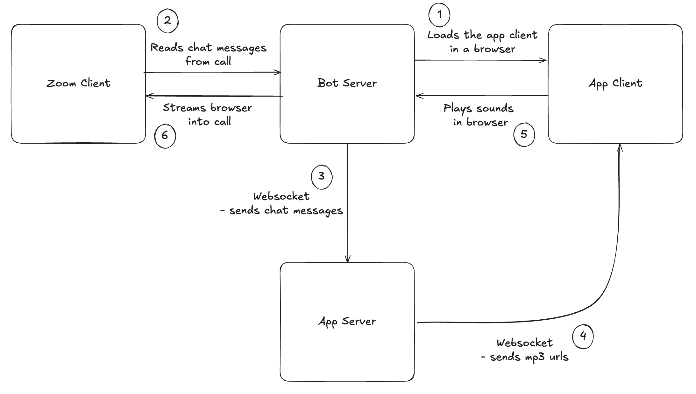

# Recall.ai Soundboard

This is a soundboard sample app that integrates with [Recall.ai](https://recall.ai) to allow playing sounds in online meetings. It uses a Recall.ai bot to join meetings and plays sounds based on commands sent through a web interface.

## Prerequisites

Before you begin, ensure you have the following installed:

- [Docker](https://docs.docker.com/get-docker/)
- [Docker Compose](https://docs.docker.com/compose/install/)
- [ngrok](https://ngrok.com/download) (for local development)

## Getting Started

1.  **Clone the repository:**

    ```bash
    git clone https://github.com/recallai/soundboard.git
    cd soundboard
    ```

2.  **Start up ngrok**

    Start up an ngrok tunnel on port 4000. You will need to add this to the .env in the next step and you will also access the app from the same ngrok URL

    ```bash
    ngrok http 4000
    ```

3.  **Create an .env file:**

    Copy the `.env.sample` file to a new file named `.env` using the command below:

    ```bash
    cp .env.sample .env
    ```

    You will need to then fill the missing variables in the .env
    Also set the ngrok url from the previous step in the APP_HOST

4.  **Run the application:**

    Once done, you can start the application in development mode using the helper script:

    ```bash
    ./scripts.sh dev:up
    ```

    Once loaded, you can then open the ngrok URL in your browser and the app should be running!

## Available Commands

This project includes a helper script `./scripts.sh` to manage the application with Docker.

**Usage:**

```bash
./scripts.sh [COMMAND]
```

**Examples:**

```bash
# Start the development server
./scripts.sh dev:up

# Stop the development server
./scripts.sh dev:down

# View logs for the development server
./scripts.sh dev:logs
```

### Development Commands

| Command           | Description                                 |
| ----------------- | ------------------------------------------- |
| `dev:build`       | Build development Docker image              |
| `dev:up`          | Start development environment (with logs)   |
| `dev:up:detached` | Start development environment in background |
| `dev:down`        | Stop development environment                |
| `dev:logs`        | Show development logs                       |

### Production Commands

| Command            | Description                                |
| ------------------ | ------------------------------------------ |
| `prod:build`       | Build production Docker image              |
| `prod:up`          | Start production environment (with logs)   |
| `prod:up:detached` | Start production environment in background |
| `prod:down`        | Stop production environment                |
| `prod:logs`        | Show production logs                       |

### Utility Commands

| Command   | Description                 |
| --------- | --------------------------- |
| `health`  | Check application heartbeat |
| `cleanup` | Clean up Docker resources   |
| `help`    | Show the help message       |

## Architecture

This application uses a Recall.ai bot to join meetings and play sounds. The process involves a user-facing control panel, a WebSocket server for real-time communication, and a special soundboard page that the bot screen-shares into the meeting.

This is what the architecture looks like:



Here’s the flow after once the bot has joined the call:

1. Bot loads the app's front-end in a browser and shares screen into the call

2. Bot connects to the app's server via websocket, reads chat messages from the meeting, and forwards the chat messages

3. The bot will match the chat message to the .mp3 url and send it to the app client via websocket

4. The app's front-end will play the media in the browser tab, which then gets streamed back into the call

### Important Files

A quick guide to the key files in this project.

`src/server.ts` is the main entry point that starts the Next.js application and the WebSocket server.

#### Client

- `src/app/(client)/_hooks/use-play-soundboard.ts`: React hook to manage the client's WebSocket connection and play sounds.

#### Server

- `src/server/websockets/initWebSocketServer.ts`: Initializes the WebSocket server. Both the client and the bot will connect to this websocket, allowing this server to receive meeting info from the bot and communicate with the client.
- `src/server/recall/createBot.ts`: Handles creating a Recall.ai bot and sends it to a meeting. The bot is configured to send a welcome chat message upon joining a meeting and screenshares this soundboard application.
- `src/server/recall/sendChatMessage.ts`: Sends a chat message to the meeting via the bot to trigger a sound.
- `src/server/recall/removeBotFromCall.ts`: Removes the Recall.ai bot from the meeting.

## Troubleshooting

### Using ngrok for Local Development

When running this application locally, you need to expose your local server to the internet so Recall.ai can connect to it. `ngrok` is a great tool for this.

The `APP_HOST` variable in your `.env` file must be set to your public `ngrok` URL.

#### Note on disposable vs static ngrok URLs

If you are using a free `ngrok` account, you will get a new disposable URL every time you restart `ngrok`. You will need to update your `.env` file with the new URL each time.

For a more stable setup, `ngrok` offers static domain names on their free plan. This will give you a permanent URL you can set in your `.env` file once.
